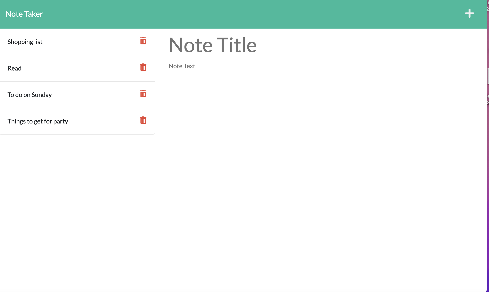
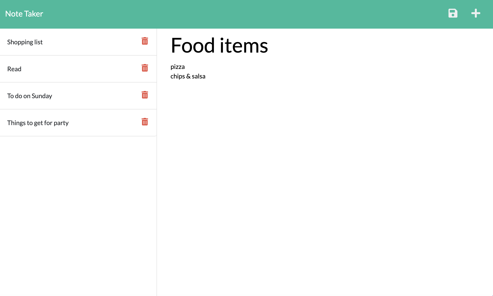

# Note Taker 

## Description
* As a small business owner, user would be able to write and save notes, so users can organize thoughts and keep track of tasks user needs to complete.

## Table to contents

-[Description](#description)

-[Acceptance Criteria](#acceptance-criteria)

-[Installation Steps](#installation-steps)

-[Mock-up Screen](#mock-up-screen)

## Acceptance-criteria

Given a note-taking application:
WHEN user opens the Note Taker, THEN user is presented with a landing page with a link to a notes page
WHEN user clicks on the link to the notes page, THEN user is presented with a page with exisiting notes listed in the left-hand column, plus empty fields to enter a new note title and the note's text in the right-hand column
WHEN user enters a new note title and the note's text, THEN a Save icon appears in the navigation at the top of the page
WHEN user clicks on the Save icon, THEN the new note user have entered is saved and appears in the left-hand column with the other exisiting notes 
WHEN user click on the existing note in the list in the left-hand column, THEN that note appears in the right-hand column
WHEN user clicks on the Write icon in the navigation at the top of the page, THEN user is presented with empty fields to enter a new note title and the note's text in the right-hand column

## Installation steps

* Make sure to install node & express by using npm init & npm install express
* To invoke, in terminal give command - node server.js 
* Future development: Add function to catch error

## Mock-up screen

### Github URL: 
https://github.com/Sivaparam/note_taker

### Live URL: 

https://note-taker-jul-22.herokuapp.com/notes

